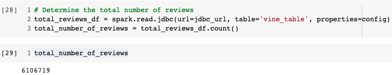
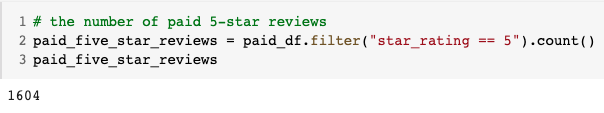
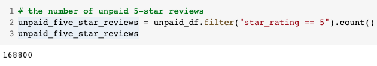
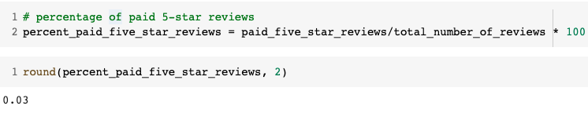
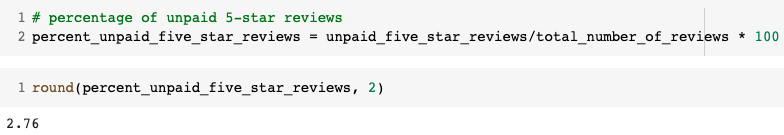

# Amazon Vine Analysis
## Overview
The purpose of this analysis is to perform ETL process using PySpark and AWS(RDS) on Amazon reviews dataset written by members of paid Amazon Vine Program. Finally an analysis is performed to determine if there is any bias toward favorable reviews from Vine members in the dataset.

## Results
Following are the results of this analysis:

### Vine and Non-Vine Reviews
Following snapshot shows that total number of reviews including both vine and non-vine reviews are 6106719:

### Vine Reviews with 5-Stars
Following snapshot shows that number of vine reviews with 5-stars are 1604:

### Non-Vine Reviews with 5-Stars
Following snapshot shows that number of non-vine reviews with 5-stars are 168800:

### Percentage of Vine Reviews with 5-Stars
Following snapshot shows that percentage of vine reviews with 5-stars is 0.03% :

### Percentage of Non-Vine Reviews with 5-Stars
Following snapshot shows that percentage of non-vine reviews with 5-stars is 2.76% :

## Summary
The percentage data shows that there is no bias in the 5-star reviews by the vine program since the percentage of vine reviews with 5-stars is considerably lower (0.03%) than the percentage of non-vine reviews with 5-stars (2.76%).

### Additional Analysis
One additional analysis we can perform is to filter the reviews where the purchase has been verified. This can give us a concrete data since the purchase of those items is verified.